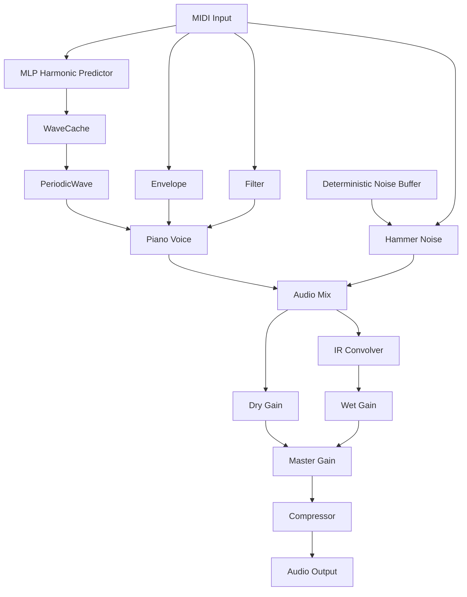

# pico-piano-synth

基于神经网络模型生成音色的轻量化 Web Audio 钢琴合成器。打包体积约 **15 KB**（gzip 约 6 KB），核心音色由约 **0.9 KB** 的小型神经网络生成，**无需任何音频采样切片（Samples）**。

适合用于体积敏感的 Web 音频项目、交互式网页、虚拟键盘及 MIDI 接口对接。

> **注意**：本项目为音频合成引擎，不包含标准 MIDI 文件（SMF）解析与播放功能。

---

## 特性

* **极小体积**：minify 后全量代码约 15 KB（含 0.9 KB 内嵌神经网络模型），gzip 后约 6 KB。
* **逼真音色**：通过神经网络预测钢琴谐波结构，结合动态包络、击弦噪声和混响，获得自然的钢琴音色。
* **纯算法合成**：无外部音频文件依赖，直接根据 MIDI 音高实时计算波形。
* **完整音域支持**：覆盖 88 键标准钢琴（MIDI 21–108）。
* **表达力控制**：支持动态按键力度（Velocity）、延音踏板（Sustain Pedal）、主音量控制及混响调节。
* **参数全可调**：包络、衰减、滤波、击弦噪声、混响、压缩器等 48 个参数集中在 `synth.settings`，构造时可覆盖、运行时可通过 `setSettings()` 增量修改。
* **单文件即插即用**：提供内嵌模型的打包版本，开箱即用。
* **零外部依赖**：原生基于浏览器 Web Audio API 开发。

当前 v2 音色模型使用 `MIDI 音高 + 谐波 bank 标记` 作为 2 个输入，网络结构为
`2 -> 24 -> 32`。两个 bank 分别预测低 32 和高 32 个谐波，合计最多 64 个谐波。

--- 

## 原理图



---

## 安装

```bash
npm install pico-piano-synth

```

---

## 快速开始

### 方式一：使用内嵌模型单文件（推荐）

```html
<script src="https://unpkg.com/pico-piano-synth@0.4.1/dist/piano-synth-embedded.min.js"></script>

<button id="play">播放</button>

<script>
let synth;

document.getElementById("play").addEventListener("click", async () => {
  // 延迟初始化实例
  synth ??= await PianoSynth.load();
  
  // 必须在用户交互回调中调用 ensure()，解锁浏览器的 AudioContext 限制
  synth.ensure();

  // 播放中央 C (MIDI 60)，力度 0.8
  synth.noteOn(60, 0.8);

  // 800ms 后关断音符
  setTimeout(() => synth.noteOff(60), 800);
});
</script>

```

### 方式二：分离式加载模型

```html
<script src="https://unpkg.com/pico-piano-synth@0.4.1/dist/piano-synth.min.js"></script>

<script>
// 手动指定二进制模型文件 (.bin) 路径
const synth = await PianoSynth.load("https://unpkg.com/pico-piano-synth@0.4.1/dist/piano_nn.bin");
</script>

```

---

## API 参考

### 创建

* **`PianoSynth.load(url?, options?)`**
  加载模型并创建合成器。不传 `url` 使用内置模型;传 `url` 从该地址加载。
  需要自己管理音频输出时,`options` 里传 `audioContext`,并把 `autoConnect` 设为 `false`;用 `OfflineAudioContext` 离线渲染时,再把 `autoResume` 设为 `false`。
* **`PianoSynth.fromBinary(buffer)`**
  从模型二进制数据(`ArrayBuffer` / `Uint8Array`)创建合成器。

### 演奏

```js
const synth = await PianoSynth.load();
synth.ensure();        // 在用户手势回调里调用,解锁浏览器音频
synth.noteOn(60, 0.8); // 弹一个音
synth.noteOff(60);     // 松键
```

* **`synth.noteOn(note, velocity?, time?, options?)`**
  演奏一个音符,返回 `note` 便于原样 `noteOff`。`note` 是 MIDI 音高(可用小数表示微分音),`velocity` 是力度 `0`–`1`,`time` 是起音时刻(秒,缺省为当前时间)。
  * `time`:到该 AudioContext 时刻才开始(排程用,不应传得过早)
  * `options.detune`:音分微调
  * `options.frequency`:直接指定频率(Hz)
  * `options.onEnded`:该音符结束时回调 `(note, velocity)`
* **`synth.noteOff(note, time?)` / `synth.allNotesOff()`** 在指定时刻(缺省为当前)停止音符 / 停止全部。排程播放就用 `noteOn(note, vel, time)` 起音、`noteOff(note, time)` 收尾。
* **`synth.noteOnHz(frequency, velocity?, time?, options?)` / `synth.noteOffHz(frequency, time?)`** 直接按频率演奏和收尾。
* **`synth.midiToHz(note)` / `synth.hzToMidi(frequency)`** 两种音高表示互转。

> 微分音:`note` 写成小数即可,例如 `60.5` 是中央 C 上方 50 cents。

### 音色与控制

* **`synth.setSustain(on)` / `synth.setVolume(v)`** 延音踏板 / 主音量。
* **`synth.setReverb(amount)` / `synth.loadIR(url)`** 混响强弱 / 换成自定义脉冲响应。
* **`synth.onNoteEnded = (note, velocity) => {}`** 监听任意音符结束。
* **`synth.metrics`** 只读观测快照:当前 `time`、`polyphony`(仍在播放的 voice 数,含释放尾音)、`sustained`、`waveCache`/`envCache` 缓存大小、音量与混响值等。

### 参数设置(synth.settings)

合成器的全部可调参数都放在实例的 **`synth.settings`** 里,覆盖音量包络、衰减曲线、低通扫频、谐波上限、击弦噪声、默认混响 IR、压缩器等。

```js
// 构造时覆盖(只写要改的键)
const synth = await PianoSynth.load(url, { settings: { reverb: 0.25, decay: 1.2 } });

// 运行时增量修改:未列出的键保持不变,返回完整的 settings
synth.setSettings({ attack: 0.004, hammerNoise: false });
synth.settings.attack;   // 读取当前值
synth.decay = 1.5;       // 快捷方式,等价于 setSettings({ decay: 1.5 })
```

`volume`、`reverb` 与压缩器参数会立即作用到音频图,其余参数在下一次 `noteOn()` 生效。修改 `a4` / `partialMaxHz` / `partialMargin` / `silentDb` 会清空波表缓存,修改 `noise*` 会重建噪声 buffer,修改 `ir*` 会重建默认 IR(`loadIR()` 载入的自定义 IR 不会被覆盖)。

| 分组 | 键(默认值) |
| --- | --- |
| 输出 | `volume` 0.8、`reverb` 0.8、`a4` 440、`waveCacheMax` 128 |
| 音量包络 | `attack` 0.001、`release` 0.3、`tcRatio` 3、`releaseTail` 0.15、`startDelay` 0.05、`minStopLead` 0.02、`velocityCurve` 2、`velocityGain` 0.5 |
| 衰减 | `decay` 1.0、`decayScale` 1.7、`decayRefNote` 60、`decayPitchDiv` 18、`decayMin` 0.5、`decayTc` 0.5、`decayTail` 4、`decayTailMin` 3.0 |
| 低通扫频 | `filterBaseHz` 492.35、`filterVelocityExp` 2.5、`filterTargetRatio` 0.1、`filterDecayRatio` 0.5、`filterQ` -1 |
| 谐波 | `partialMaxHz` 12000、`partialMargin` 0.98、`silentDb` -200 |
| 击弦噪声 | `hammerNoise` true、`hammerGain` 3、`hammerCutoffOffset` 1000、`hammerAttack` 0.0012、`hammerDur` 0.016、`hammerDurVelocity` 0.028、`hammerStopTail` 0.02、`noiseDuration` 0.08、`noisePink` 0.02、`noiseSeed` 42、`silenceFloor` 0.0001 |
| 默认混响 IR | `irDuration` 1.6、`irDecay` 50、`irDamping` 0.22、`irSeed` 411 |
| 压缩器 | `compressorThreshold` -24、`compressorKnee` 30、`compressorRatio` 12、`compressorAttack` 0.003、`compressorRelease` 0.25 |

### 接入自己的音频链路

默认会直接出声。要把声音送进自己的混音或效果链时:

```js
const synth = await PianoSynth.load(url, {
  audioContext: myContext,
  autoConnect: false
});
synth.output.connect(myMixer);
```

不再使用时调用 **`synth.dispose()`** 释放资源。

---

## 本地 Demo

demo 页面提供 88 键键盘、SMF/MIDI 播放、WAV 离线导出与 Web MIDI 接入。
`npm run dev` 把 demo 挂到 `http://localhost:3000/`,改动后浏览器自动刷新。

```bash
npm run dev -- --port 8080 --open   # 换端口 / 自动打开浏览器
npm run dev -- --host 0.0.0.0       # 局域网设备访问(localhost/HTTPS 之外 Web Audio 不可用)
```


---

## 致谢

项目的极简前端音源设计思路受 [PicoAudio.js](https://github.com/cagpie/PicoAudio.js) 启发。

---

## 开源协议

[MIT License](LICENSE)

---
